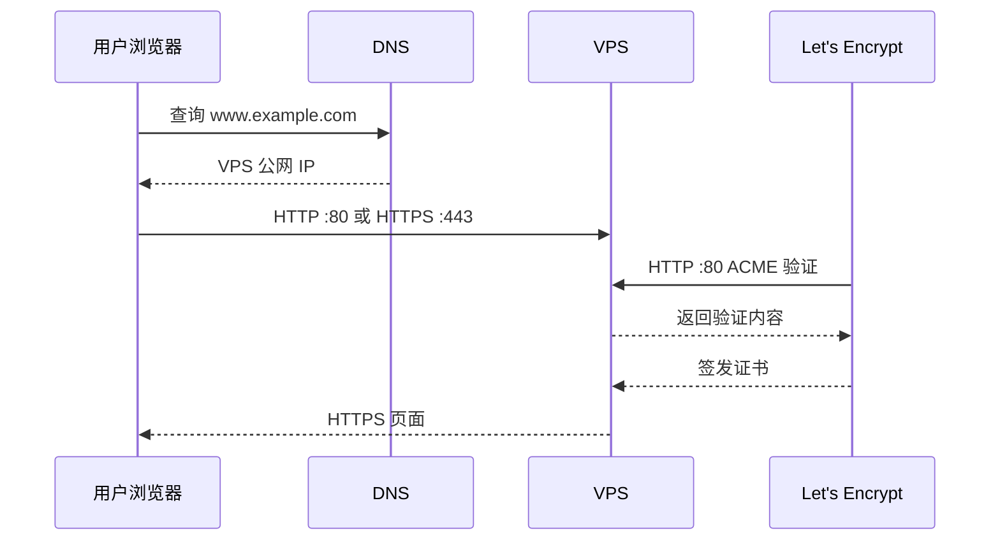
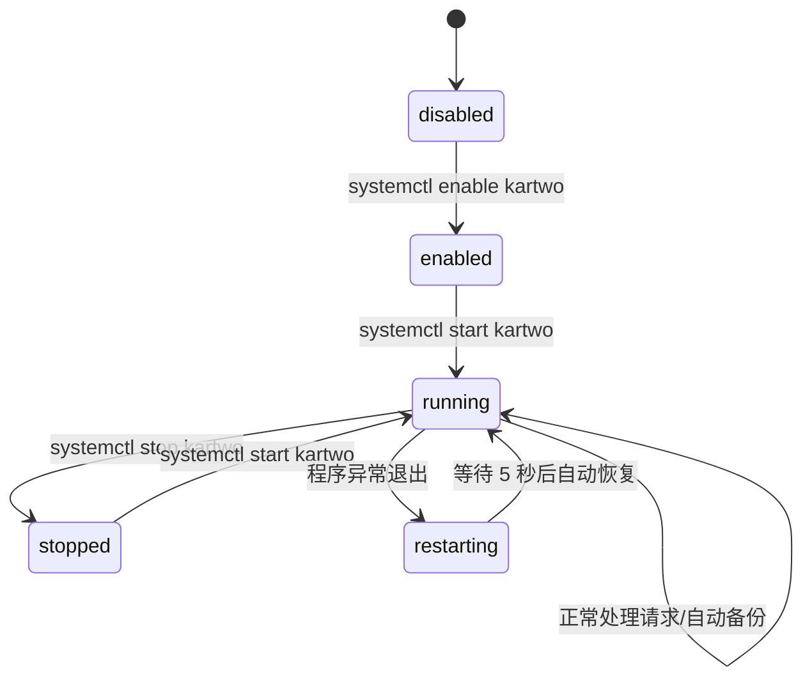

# Kartwo 生产部署图文手册 / Production Deployment Guide

> 功能：Linux VPS 上以 systemd 运行 Kartwo，使用内嵌 Let's Encrypt 自动 HTTPS。
> 作者：仗键天涯(daxing)
> 邮箱：3442535897@qq.com
> 时间：2026-08-25 12:00:00

本手册面向已有 Linux 服务器和域名的商家。Kartwo 生产模式自行监听 HTTP `80` 与 HTTPS `443`，申请和续期证书时不需要安装 Nginx 或 Certbot。

> 安全提醒：不要把 `sk_`、`pk_`、`whsec_`、后台口令、SSH 私钥或数据库文件发到聊天记录、截图、Git 仓库或视频中。

## 0. 先理解整体结构

```mermaid
flowchart TD
    A[浏览器访问域名] --> B{访问端口}
    B -->|HTTP :80| C[Kartwo HTTP 服务]
    C --> D[Let's Encrypt 域名验证]
    C --> E[301 跳转到 HTTPS]
    B -->|HTTPS :443| F[Kartwo HTTPS 服务]
    F --> G[店面、后台、API]
    H[systemd] --> F
    H --> C
    F --> I[/data/kartwo-data/shop.db]
    F --> J[/data/kartwo-data/media]
    F --> K[/data/kartwo-data/backups]
```

生产服务的职责分配如下：

| 组件 | 负责什么 |
| --- | --- |
| DNS | 将域名解析到 VPS 公网 IP |
| 云安全组和 UFW | 允许公网进入 TCP `80`、`443` |
| Kartwo HTTP 服务 | ACME 验证和 HTTP 到 HTTPS 的跳转 |
| Kartwo HTTPS 服务 | 店面、后台、支付回调和 API |
| Let's Encrypt | 签发和续期公开 HTTPS 证书 |
| systemd | 后台运行、开机自启、异常重启和日志 |

下面以 `www.example.com` 和 `/data/kartwo-data` 举例。请在命令中替换成自己的精确域名和实际数据目录。域名不要带 `https://`、路径或端口。

## 1. 上线前检查

### 图 1：域名、端口与服务的关系



在同一个数据目录运行过开发或验收服务时，先停止它。SQLite 数据库不应由两个 Kartwo 进程同时作为主实例使用。

```bash
# 在旧的前台 Kartwo 终端按 Ctrl+C 停止；不要删除数据目录。

DOMAIN="www.example.com"

# 查看 80、443、8191 是否已被其他程序占用。
ss -ltnp | grep -E ':(80|443|8191)\b' || true

# 查询域名的 IPv4 地址。
getent ahostsv4 "$DOMAIN"

# 查询这台 VPS 对外显示的 IPv4 地址。
curl -4 -s https://ifconfig.co; echo
```

`getent` 与 `curl` 输出的公网 IP 必须一致。若不一致，证书验证会去到另一台服务器。

确认两层防火墙都放行 TCP `80` 与 `443`：

1. 云厂商控制台的安全组/防火墙入站规则。
2. 服务器操作系统防火墙。

Ubuntu 使用 UFW 时：

```bash
ufw allow 80/tcp
ufw allow 443/tcp
ufw status
```

若使用 Cloudflare，第一次签发证书时建议将记录切到“仅 DNS/灰云”。不要使用 Cloudflare 的 `Flexible SSL`；证书正常后如需代理，使用 `Full (strict)`。

## 2. 放置正式二进制和数据目录

```bash
# 放置应用二进制的标准目录。
install -d -m 0755 /opt/kartwo

# 把已验证的 Linux x86_64 二进制复制为固定服务路径。
install -m 0755 /path/to/kartwo-linux-amd64 /opt/kartwo/kartwo

# 创建不能登录的专用系统账户；已存在时不重复创建。
id kartwo >/dev/null 2>&1 || useradd --system --home /opt/kartwo --shell /usr/sbin/nologin kartwo

# 让服务账户能读写数据库、媒体、备份与证书缓存。
chown -R kartwo:kartwo /data/kartwo-data
```

为什么不直接使用 `root`：Kartwo 需要服务权限，而不是整台机器的管理员权限。专用 `kartwo` 用户将潜在问题限制在业务目录内。

普通用户本来不能监听 `80`、`443` 这类低端口。下一节会通过 systemd 只授予 `CAP_NET_BIND_SERVICE` 这一项最小能力，而不让应用拥有完整 root 权限。

## 3. 创建 systemd 服务

创建 `/etc/systemd/system/kartwo.service`：

```ini
[Unit]
Description=Kartwo storefront
After=network-online.target
Wants=network-online.target

[Service]
Type=simple
User=kartwo
Group=kartwo
WorkingDirectory=/opt/kartwo
Environment=KARTWO_ENV=prod
Environment=KARTWO_DOMAIN=www.example.com
Environment=KARTWO_BASE_URL=https://www.example.com
Environment=KARTWO_HTTP_ADDR=:80
Environment=KARTWO_HTTPS_ADDR=:443
Environment=KARTWO_DATA_DIR=/data/kartwo-data
Environment="KARTWO_SHOP_NAME=My Store"
ExecStart=/opt/kartwo/kartwo serve
Restart=on-failure
RestartSec=5
AmbientCapabilities=CAP_NET_BIND_SERVICE
CapabilityBoundingSet=CAP_NET_BIND_SERVICE
NoNewPrivileges=true
UMask=0077
PrivateTmp=true
ProtectHome=true
ReadWritePaths=/data/kartwo-data

[Install]
WantedBy=multi-user.target
```

逐项替换：

| 配置 | 应填写的值 | 用途 |
| --- | --- | --- |
| `KARTWO_DOMAIN` | `www.example.com` | 精确证书域名 |
| `KARTWO_BASE_URL` | `https://www.example.com` | 支付回跳、邮件和公开链接的基础地址 |
| `KARTWO_DATA_DIR` | 实际持久化目录 | 数据库、媒体、备份、证书缓存 |
| `KARTWO_SHOP_NAME` | 店铺名称 | 店面显示名；含空格必须保留双引号 |

特别注意这行：

```ini
Environment="KARTWO_SHOP_NAME=My Store"
```

错误写法会被 systemd 拆开：

```ini
Environment=KARTWO_SHOP_NAME=My Store
```

错误日志通常是：

```text
Invalid environment assignment, ignoring: Store
```

服务配置加载并启动：

```bash
systemctl daemon-reload
systemctl enable --now kartwo
systemctl status kartwo --no-pager
journalctl -u kartwo -n 80 --no-pager
```

这四条分别表示：

1. `daemon-reload`：让 systemd 重新读取服务文件。
2. `enable --now`：建立开机自启关联，并立刻启动。
3. `status`：查看当前是否为 `active (running)`。
4. `journalctl`：读取最近 80 行服务日志。

正常日志应包含：

```text
自动 HTTPS 已启用
HTTP 服务启动 ... role=prod-http-challenge
HTTPS 服务启动 ... role=prod-https
```

## 4. 验证 HTTP、HTTPS 和数据层

首次访问会触发证书签发，通常需要数秒到几十秒。运行：

```bash
DOMAIN="www.example.com"

curl -I "http://$DOMAIN/"
curl -I "https://$DOMAIN/"
curl -s "https://$DOMAIN/health"
```

预期结果：

| 命令 | 正常结果 | 说明 |
| --- | --- | --- |
| HTTP 请求 | `301` 或 `308`，含 `Location: https://...` | 明文访问被强制升级至 HTTPS |
| HTTPS 请求 | `HTTP/2 200` 或 `HTTP/1.1 200` | TLS 证书、443 端口和 Kartwo 页面都正常 |
| 健康检查 | JSON 中有 `"status":"ok"` 和 `"db":"ok"` | 进程与数据库都正常 |

浏览器再打开：

```text
https://www.example.com/
https://www.example.com/admin/
```

确认地址栏显示锁形安全连接，店面、后台、商品和图片均可访问。

## 5. 日常运行、日志与备份

### 图 2：systemd 服务生命周期



日常最常用的命令：

```bash
# 查看进程是否正在后台运行。
systemctl status kartwo --no-pager

# 实时追踪日志；Ctrl+C 仅退出查看，不停止服务。
journalctl -u kartwo -f

# 读取最近 100 行日志。
journalctl -u kartwo -n 100 --no-pager

# 修改服务文件、更新二进制或保存“重启后生效”的设置后使用。
systemctl restart kartwo

# 检查公开服务与数据库。
curl -s https://www.example.com/health

# 查看最近自动备份。
find /data/kartwo-data/backups -maxdepth 1 -type f -name 'kartwo-backup-*.zip' \
  -printf '%TY-%Tm-%Td %TH:%TM %f %s bytes\n' | sort | tail -n 5
```

服务状态的含义：

| 状态 | 含义 | 下一步 |
| --- | --- | --- |
| `active (running)` | 正常后台运行 | 无需操作 |
| `inactive (dead)` | 服务已停止 | `systemctl start kartwo` |
| `failed` | 启动失败或异常退出 | 先检查日志，不要盲目反复重启 |

## 6. 常见故障定位

### HTTPS 未签发或访问失败

不要反复重启，避免触发 Let's Encrypt 的失败验证频率限制。先收集：

```bash
journalctl -u kartwo -n 120 --no-pager
ss -ltnp | grep -E ':(80|443)\b' || true
getent ahostsv4 "www.example.com"
```

逐项检查：

1. 域名解析 IP 是否就是当前 VPS 公网 IP。
2. 云安全组与 UFW 是否都放行 `80`、`443`。
3. 是否有 Nginx、Apache 或其他程序占用端口。
4. `KARTWO_DOMAIN` 是否是精确域名。
5. Cloudflare 是否临时使用灰云，且没有使用 Flexible SSL。

### 修改配置后没有生效

若改的是 systemd 服务文件：

```bash
systemctl daemon-reload
systemctl restart kartwo
```

若改的是后台中标记“重启服务后生效”的设置，只需：

```bash
systemctl restart kartwo
```

### 服务突然不可访问

按以下顺序检查：

```bash
systemctl status kartwo --no-pager
curl -s https://www.example.com/health
journalctl -u kartwo -n 120 --no-pager
```

不要通过删除 `/data/kartwo-data` 来排障；其中含真实订单、商品、媒体和备份。

## 7. 更新版本的标准流程

先保留旧二进制并备份数据目录。确认新版本可启动后，再清理旧文件：

```bash
# 将新产物放到临时固定位置并赋予执行权限。
install -m 0755 /path/to/kartwo-new-linux-amd64 /opt/kartwo/kartwo.new

# 可选：检查新版本信息。
/opt/kartwo/kartwo.new version

# 替换正在被服务使用的二进制，然后重启。
mv /opt/kartwo/kartwo.new /opt/kartwo/kartwo
systemctl restart kartwo

# 立刻验证服务、日志与健康检查。
systemctl status kartwo --no-pager
journalctl -u kartwo -n 80 --no-pager
curl -s https://www.example.com/health
```

若新版本含数据库迁移，Kartwo 会在有待执行迁移时先创建升级快照。仍应在升级前保留独立备份，不要只依赖服务器单块磁盘。

## 8. 十分钟录屏分镜与讲稿

以下分镜可直接用于录制产品教程。录屏前准备一个脱敏示例域名、空白或演示数据目录；绝不录入真实 Stripe 密钥、口令或服务器 IP。

| 时长 | 屏幕画面 | 讲解要点 |
| --- | --- | --- |
| 0:00–0:35 | 终端与一张部署结构图 | “Kartwo 是单二进制服务，生产模式自身处理 80、443 和 HTTPS。” |
| 0:35–1:30 | 域名 DNS 与 `getent` / `ifconfig.co` 输出 | “先确认域名和服务器公网 IP 指向一致，否则证书验证会失败。” |
| 1:30–2:10 | 云安全组和 UFW 规则 | “80 用于验证和跳转，443 是正式 HTTPS；两层防火墙都要放行。” |
| 2:10–3:10 | `/opt/kartwo`、数据目录和专用账户命令 | “二进制与数据分离，数据目录才是商品、订单、图片和备份。” |
| 3:10–5:00 | 编辑 `kartwo.service` | “systemd 让服务不依赖 SSH 终端；特别注意店铺名包含空格时要加双引号。” |
| 5:00–6:00 | `daemon-reload`、`enable --now`、`status` | “enable 是开机自启，now 是立即启动，active running 代表后台正常运行。” |
| 6:00–7:00 | `journalctl` 中的 HTTPS/HTTP 启动日志 | “这三条日志确认自动 HTTPS、80 证书验证端口、443 正式服务都已启动。” |
| 7:00–8:00 | `curl -I` 与 `/health` 输出 | “301 证明 HTTP 自动跳 HTTPS；200 和 db ok 证明证书、应用、数据库完整连通。” |
| 8:00–9:00 | 浏览器访问店面和后台 | “确认地址栏锁标志，并浏览商品和后台。” |
| 9:00–10:00 | `systemctl status`、`journalctl -f`、备份列表 | “日常只要关注后台状态、健康检查和备份是否持续产生。” |

录屏结束时可展示这组日常巡检命令：

```bash
systemctl status kartwo --no-pager
curl -s https://www.example.com/health
find /data/kartwo-data/backups -maxdepth 1 -type f -name 'kartwo-backup-*.zip' -printf '%TY-%Tm-%Td %TH:%TM %f\n' | sort | tail -n 3
```

只要服务为 `active (running)`、健康检查返回 `status: ok` 与 `db: ok`、备份持续产生，基础运行状态就是健康的。
